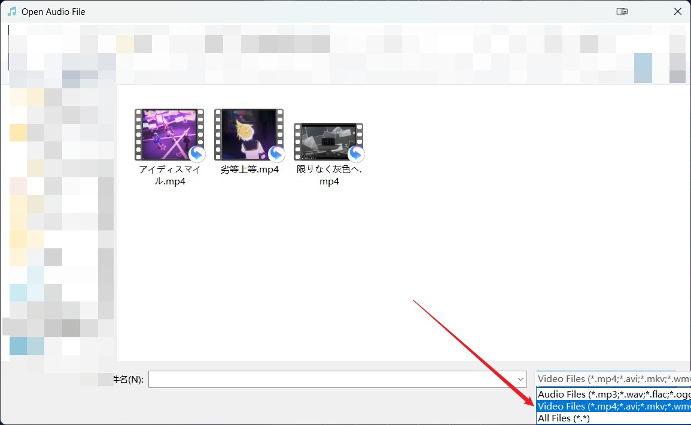
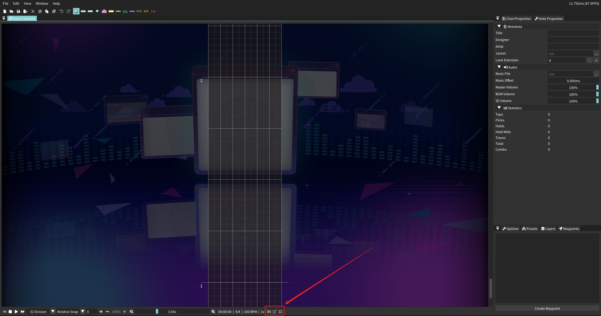
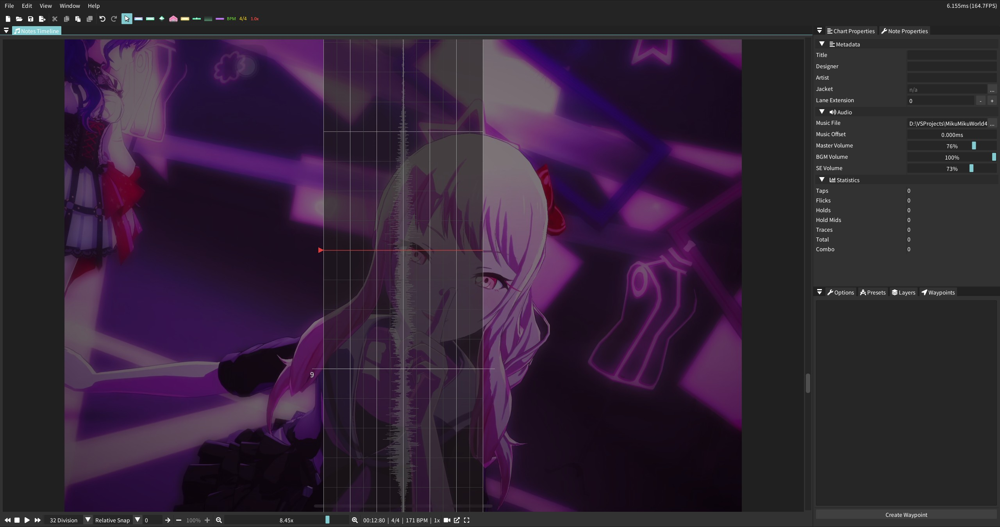
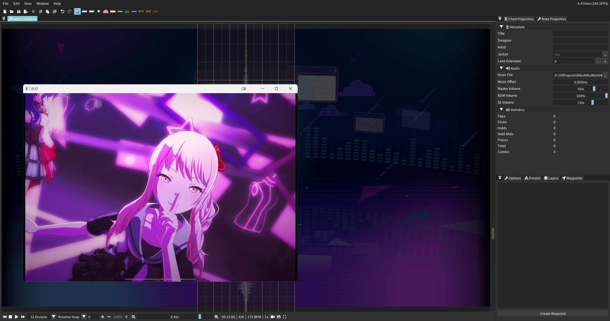

# MMW-Video

**This is a fork from [MikuMikuWorld4CC](https://github.com/sevenc-nanashi/MikuMikuWorld4CC).**
What's new is that now you can **play video** synchronously with music.

### How to use?
There are 2 additional things compared to original MikuMikuWorld4CC:
+ When you open a music file, you can also choose a video file. **MP4** format is suggested especially for high-frame-rate video (FPS > 31)
    

    
    

+ At the bottom of interface, there are 3 new buttons. Press the first one to show the video you have imported. Press the second one to switch playing mode (new window / background).
    

    
    

    

    
    
    

### Note
+ This project is developed based on MikuMikuWorld4CC-3.1.2.30. So modification after 3.1.2.30 may be not contained. And it also may not be compatible with too old versions.
+ The copyright of MikuMikuWorld4CC belongs to the original author [@sevenc-nanashi](https://github.com/sevenc-nanashi)